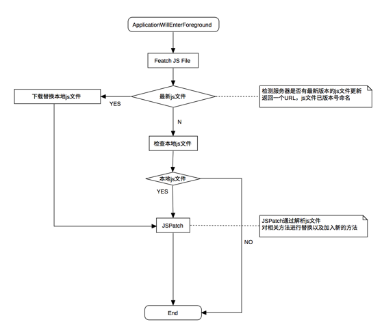
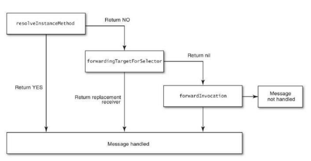

#热修复
----
[Toc]


>由于种种原因，线上bug总是不可避免的。受限于客户端程序bug的修改需要依赖于安装包的升级，且iOS审核周期较长，导致线上bug无法及时处理。由此引申出了热修复这个议题。

##成熟方案

###[Wax](https://github.com/alibaba/wax)
- 基于lua
- 语法难以理解

###[JSPatch](https://github.com/bang590/JSPatch)
- 基于JavaScript
- 提供Xcode语法提示插件
- 提供OC方法转js方法的工具

##滚雪球热修复
JSPatch由JavaScript语言实现，语法比较贴合swift，用起来比较熟悉。而Wax采用`:`的形式调用，容易出错。且JSPatch作者提供了一些工具、以及详细的[文档](https://github.com/bang590/JSPatch/wiki)
，所以最终选用JSPatch作为热修复方案.

###维度区分
1. 用户维度
	- 普通用户
	- 灰度用户
2. App版本维度
	- 不同app版本不同修复文件
	- 不同系统版本不同修复文件
3. 系统版本维度
   - 不同系统版本，可能热修复的js文件不同
4. 无条件禁用维度
5. App维度，区分同一公司的不同App

###接口设计
1.`hotfix/checkHotfixFileStatus`

- 检查并返回当前用户、当前App版本最新js文件
- 提供灰度用户功能

```json
/* request */
{
	"sid":"sid",
	"uid":"uid",
	"appversion":"2.5.5",
	"iosversion":"9.3",
	"apptype":"1"
}
/* response */
{
	"disable":"0", 
	"data": {
		"version":"1.0.0", 
		"url":"http://www.baidu.com" 
	}
}
```

**request**

|key|type|value|description|
|---|:--:|:---:|:---------:|
|sid|String|-|用户登录态|
|uid|String|-|用户标识|
|appversion|String|-|app版本号|
|iosversion|String|9.3|版本前两位 9.3 = 9.3.x|
|apptype|String|(1,2)|App类型，1：滚雪球，2：金斧子财富App|

**response**

|key|type|value|description|
|---|:--:|:---:|:---------:|
|disable|String|0 or 1|1:disable hotfix，暂时不使用，传0|
|data.version|String|-|the latest js file version for current user and app version|
|data.url|String|-|download url|

###更新策略


###安全
####方案一：RSA非对称加密
服务端

- 计算JS文件MD5值
- 用RSA私钥对MD5进行加密，与JS文件一起下发给客户端

客户端

- 拿到加密数据，用RSA公钥解密出MD5值。
- 本地计算返回的JS文件的MD5值
- 对比两个MD5值，当通过校验的时候，将JS文件保存（用对称加密将JS文件加密）到本地。

#### 方案二：HTTPS

# vs Runtime
## 访问运行时的三种方式
1. Object-C代码自己调用
2. 通过NSObject中预定义的方法进行调用
3. 直接调用Runtime方法

###  Object-C代码自己调用
隐藏参数 `_cmd` `self`

```objectivec
[array count]
objc_msgSend(array, selector)
objc_msgSend(receiver, selector, arg1, arg2, ...)
```
*The compiler generates calls to the messaging function. You should never call it directly in the code you write.*

**SEL**

```objectivec
/// An opaque type that represents a method selector.
typedef struct objc_selector *SEL;
```
**IMP**

```objectivec
typedef id (*IMP)(id, SEL, ...);
```

**Method**

```objectivec
/// An opaque type that represents a method in a class definition.
typedef struct objc_method *Method;
struct objc_method {
    SEL method_name    OBJC2_UNAVAILABLE;
    char *method_types OBJC2_UNAVAILABLE;
    IMP method_imp     OBJC2_UNAVAILABLE;
}
```

### 通过NSObject中预定义的方法进行调用

```objectivec
+ (BOOL)instancesRespondToSelector:(SEL)aSelector;
+ (BOOL)conformsToProtocol:(Protocol *)protocol;
- (IMP)methodForSelector:(SEL)aSelector;
+ (IMP)instanceMethodForSelector:(SEL)aSelector;
- (void)doesNotRecognizeSelector:(SEL)aSelector;
```

###  直接调用Runtime方法

```objectivec
const char * class_getName(Class cls) 
...
```

## 获取方法地址
```
    void (*setter)(id, SEL, id, id);
    int i;
    id target = [NSMutableDictionary new];
    
    setter = (void (*)(id, SEL, id, id))[target methodForSelector:@selector(setObject:forKey:)];
    for ( i = 0 ; i < 1000 ; i++ )
        setter(target, @selector(setObject:forKey:), @(i).stringValue, @(i).stringValue);
    return [target count] == 1000;
```

## 动态方法解析
**在Objective-C中，消息与实现并没有直接绑定在一起，知道运行时，才会动态获取。**

1. 找到receiver的selector对应的IMP
2. 通知程序，向receiver传输所需的参数
3. 然后返回计算后的返回值
 


dispatch table  && cache table

- A pointer to the superclass
- A Class dispatch table.
 
## 消息转发过程
**对象接收到消息的时候，首先会调用这两个方法。**

```objectivec
+ (BOOL)resolveInstanceMethod:(SEL)sel
+ (BOOL)resolveClassMethod:(SEL)sel
```
**如果上一步无法处理消息**

```objectivec
- (id)forwardingTargetForSelector:(SEL)aSelector
```
**最后还不能处理消息**

```objectivec
- (void)forwardInvocation:(NSInvocation *)anInvocation
- (NSMethodSignature *)methodSignatureForSelector:(SEL)aSelector
```




## 附录
[Objective-C Runtime Programming Guide](https://developer.apple.com/library/mac/documentation/Cocoa/Conceptual/ObjCRuntimeGuide/Introduction/Introduction.html#//apple_ref/doc/uid/TP40008048-CH1-SW1)

[Objective-C Runtime Reference](https://developer.apple.com/library/ios/documentation/Cocoa/Reference/ObjCRuntimeRef/index.html#//apple_ref/doc/uid/TP40001418-CH1g-188234)

[Calling methods from strings in Swift](http://codelle.com/blog/2016/2/calling-methods-from-strings-in-swift/)

[Objective-C Runtime 运行时之三：方法与消息](http://southpeak.github.io/blog/2014/11/03/objective-c-runtime-yun-xing-shi-zhi-san-:fang-fa-yu-xiao-xi-zhuan-fa/)